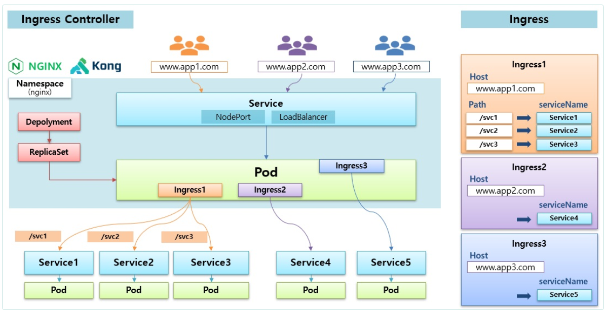

# Ingress

> Service Loadbalancing, Canary Upgrade




  ## 1. Nginx Controller
  
  

   ### 1-1) Nginx 설치
```bash
kubectl apply -f https://raw.githubusercontent.com/kubernetes/ingress-nginx/controller-v1.8.2/deploy/static/provider/baremetal/deploy.yaml
```

   ### 1-2) NodePort Service 생성

```
위 Nginx 설치에 포함되어 있음, v1.27에서는 NodePort Service 별도로 생성 안함
```

  ## 2. Service Loadbalancing
  
  


   ### 2-1) Shopping Page
```yml   
apiVersion: v1
kind: Pod
metadata:
  name: pod-shopping
  labels:
    category: shopping
spec:
  containers:
  - name: container
    image: itwillacademy/shopping
---
apiVersion: v1
kind: Service
metadata:
  name: svc-shopping
spec:
  selector:
    category: shopping
  ports:
  - port: 8080
```

   ### 2-2) Customer Center
```yml   
apiVersion: v1
kind: Pod
metadata:
  name: pod-customer
  labels:
    category: customer
spec:
  containers:
  - name: container
    image: itwillacademy/customer
---
apiVersion: v1
kind: Service
metadata:
  name: svc-customer
spec:
  selector:
    category: customer
  ports:
  - port: 8080
```

   ### 2-3) Order Service
```yml
apiVersion: v1
kind: Pod
metadata:
  name: pod-order
  labels:
    category: order
spec:
  containers:
  - name: container
    image: itwillacademy/order
---
apiVersion: v1
kind: Service
metadata:
  name: svc-order
spec:
  selector:
    category: order
  ports:
  - port: 8080
```

   ### 2-4) Ingress
v1.27
```yml
apiVersion: networking.k8s.io/v1
kind: Ingress
metadata:
  name: service-loadbalancing
spec:
  ingressClassName: nginx
  rules:
  - http:
      paths:
      - path: /
        pathType: Prefix
        backend:
          service:
            name: svc-shopping
            port:
              number: 8080
      - path: /customer
        pathType: Prefix
        backend:
          service:
            name: svc-customer
            port:
              number: 8080
      - path: /order
        pathType: Prefix
        backend:
          service:
            name: svc-order
            port:
              number: 8080
```

- **ingress-nginx 네임스페이스선택후 Service선택후 ingress-nginx-controller NodePort port변경**


- **Pod IP((pod-shopping,pod-customer,pod-order))로 요청**


```bash
[root@k8s-master sample]# curl 10.104.96.176:8080
Shopping Service.
[root@k8s-master sample]# curl 20.96.169.130:8080
Order Service.
[root@k8s-master sample]# curl 20.96.169.141:8080
Customer Service.
```

- **Service IP(svc-shopping,svc-customer,svc-order) 로 요청**

```bash
[root@k8s-master sample]# curl 10.104.96.176:8080
Shopping Service.
[root@k8s-master sample]# curl 10.106.22.103:8080
Customer Service.
[root@k8s-master sample]# curl 10.102.102.4:8080
Order Service.
```
- **Node IP( k8s-master,k8s-node1,k8s-node2 )로 요청**
```bash
[root@k8s-master sample]# curl 192.168.56.30:30431/
[root@k8s-master sample]# curl 192.168.56.31:30431/
[root@k8s-master sample]# curl 192.168.56.32:30431/
Shopping Service.
[root@k8s-master sample]# curl 192.168.56.30:30431/order
[root@k8s-master sample]# curl 192.168.56.31:30431/order
[root@k8s-master sample]# curl 192.168.56.32:30431/order
Order Service.
[root@k8s-master sample]# curl 192.168.56.30:30431/customer
[root@k8s-master sample]# curl 192.168.56.31:30431/customer
[root@k8s-master sample]# curl 192.168.56.32:30431/customer
Customer Service.


```

  ## 3. Canary Upgrade

  

   ### v3-1) App V1
```yml   
apiVersion: v1
kind: Pod
metadata:
  name: pod-v1
  labels:
    app: v1
spec:
  containers:
  - name: container
    image: itwillacademy/app:v1
---
apiVersion: v1
kind: Service
metadata:
  name: svc-v1
spec:
  selector:
    app: v1
  ports:
    port: 80
    targetPort: 80
```  
   ### 3-2) App V2
```yml   
apiVersion: v1
kind: Pod
metadata:
  name: pod-v2
  labels:
    app: v2
spec:
  containers:
  - name: container
    image: itwillacademy/app:v2
---
apiVersion: v1
kind: Service
metadata:
  name: svc-v2
spec:
  selector:
    app: v2
  ports:
    port: 80
    targetPort: 80
```

   ### 3-3) Ingress - default

v1.27

```yml
apiVersion: networking.k8s.io/v1
kind: Ingress
metadata:
  name: app
spec:
  ingressClassName: nginx
  rules:
  - host: www.app.com
    http:
      paths:
      - path: /
        pathType: Prefix
        backend:
          service:
            name: svc-v1
            port:
              number: 80
```

v1.27
```bash
# Centos HostName 등록
[root@k8s-master /]# 
cat << EOF >> /etc/hosts
192.168.56.30 www.app.com
EOF

[root@k8s-master /]# curl www.app.com:30431/version
Version : v1

```

   ### 3-4) Ingress - weight

v1.27

```yml
apiVersion: networking.k8s.io/v1
kind: Ingress
metadata:
  name: canary-v2
  annotations:
    nginx.ingress.kubernetes.io/canary: "true"
    nginx.ingress.kubernetes.io/canary-weight: "10"
spec:
  ingressClassName: nginx
  rules:
  - host: www.app.com
    http:
      paths:
      - path: /
        pathType: Prefix
        backend:
          service:
            name: svc-v2
            port:
              number: 8080
```
- **10% 비율로 v2로 traffic 이전달**
```bash
[root@k8s-master /]# while true; do curl www.app.com:30431/version; sleep 1; done
Version : v1
Version : v1
Version : v1
Version : v1
Version : v1
Version : v1
Version : v1
Version : v1
Version : v1
Version : v2
Version : v1
.
.
```

<hr>

# guest application
 
> guest-Ingress1.yaml

```yml   
apiVersion: v1
kind: Pod
metadata:
  name: pod-guest-v1
  labels:
    app: guest-v1
spec:
  containers:
  - name: container
    image: academyitwill/guest:v1
    imagePullPolicy: Always
---
apiVersion: v1
kind: Service
metadata:
  name: service-guest-v1
spec:
  selector:
     app: guest-v1
  ports:
  - port: 80
---
apiVersion: networking.k8s.io/v1
kind: Ingress
metadata:
  name: ingress-guest-v1
spec:
  ingressClassName: nginx
  rules:
  - http:
      paths:
      - path: /
        pathType: Prefix
        backend:
          service:
            name: service-guest-v1
            port:
              number: 80

``` 

> guest-Ingress2.yaml

```yml
apiVersion: v1
kind: Pod
metadata:
  name: pod-guest-v2
  labels:
    app: guest-v2
spec:
  containers:
  - name: container
    image: academyitwill/guest:v2
    imagePullPolicy: Always
---
apiVersion: v1
kind: Service
metadata:
  name: service-guest-v2
spec:
  selector:
    app: guest-v2
  ports:
  - port: 80
---
apiVersion: networking.k8s.io/v1
kind: Ingress
metadata:
  name: ingress-guest-v2
  annotations:
    nginx.ingress.kubernetes.io/canary: "true"
    nginx.ingress.kubernetes.io/canary-weight: "30"
spec:
  ingressClassName: nginx
  rules:
  - http:
      paths:
      - path: /
        pathType: Prefix
        backend:
          service:
            name: service-guest-v2
            port:
              number: 80
```

## command

```bash
# 최초 오브젝트 생성
kubectl create -f guest-Ingress1.yaml
# 수정후 적용
kubectl apply -f guest-Ingress1.yaml
# 대체
kubectl replace --force -f guest-Ingress1.yaml
# 삭제
kubectl delete -f guest-Ingress1.yaml
```


- **30% 비율로 v2로 traffic 이전달**
```bash
[root@k8s-master /]# while true; do curl 192.168.56.30:30431/version; sleep 1; done
Version : v1
Version : v1
Version : v1
Version : v1
Version : v1
Version : v1
Version : v2
Version : v2
Version : v1
Version : v2
.
.
```

   ### 3-5) Ingress - header

v1.27

```yml
apiVersion: networking.k8s.io/v1
kind: Ingress
metadata:
  name: canary-kr
  annotations:
    nginx.ingress.kubernetes.io/canary: "true"
    nginx.ingress.kubernetes.io/canary-by-header: "Accept-Language"
    nginx.ingress.kubernetes.io/canary-by-header-value: "kr"
spec:
  ingressClassName: nginx
  rules:
  - host: www.app.com
    http:
      paths:
      - path: /
        pathType: Prefix
        backend:
          service:
            name: svc-v2
            port:
              number: 8080
```

```bash
curl -H "Accept-Language: kr" www.app.com:30431/version
```