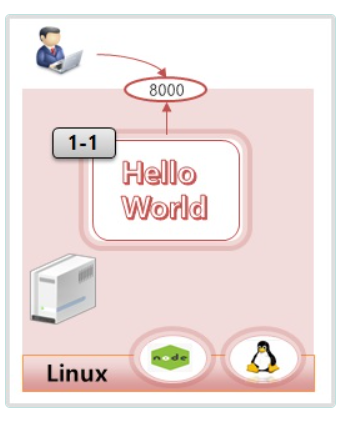
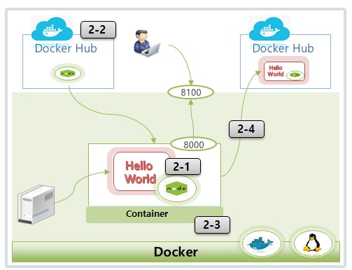

# Getting-Started Kubernetes!


## 1. Linux



### 1-0) k8s-master CentOS에 nodejs 설치 :


```
[root@k8s-master ~]# yum install epel-release
[root@k8s-master ~]# yum -y install nodejs
[root@k8s-master ~]# mkdir hello
[root@k8s-master ~]# cd hello
[root@k8s-master hello]# vi hello.js

var http = require('http');
var content = function(req, resp) {
resp.end("Hello Kubernetes!" + "\n");
resp.writeHead(200);
}
var w = http.createServer(content);
w.listen(8000);

1. vi hello.js 엔터키키
2. hello.js내용을 복사한후 붙여넣기를한다
3. :wq 를 입력한후 엔터키를 누른다.

[root@k8s-master hello]#     
```

#### 1-1) hello.js

```
var http = require('http');
var content = function(req, resp) {
resp.end("Hello Kubernetes!" + "\n");
resp.writeHead(200);
}
var w = http.createServer(content);
w.listen(8000);
```


```
[root@k8s-master ~]# node hello.js
```


## 2. Docker



  ### 2-1) Dockerfile

```
FROM node:slim
EXPOSE 8000
COPY hello.js .
CMD node hello.js
```

```
[root@k8s-master hello]# vi Dockerfile

FROM node:slim
EXPOSE 8000
COPY hello.js .
CMD node hello.js

1. vi Dockerfile 엔터키키
2. Dockerfile내용을 복사한후 붙여넣기를한다
3. :wq 를 입력한후 엔터키를 누른다.

[root@k8s-master hello]# ls
Dockerfile  hello.js
```


  2-2) Docker install


```
[root@k8s-master hello]# echo '======== 도커 설치 ========'
[root@k8s-master hello]# #https://download.docker.com/linux/centos/8/x86_64/stable/Packages/ 저장소 경로
[root@k8s-master hello]# yum install -y yum-utils
[root@k8s-master hello]# yum-config-manager --add-repo https://download.docker.com/linux/centos/docker-ce.repo
[root@k8s-master hello]# yum install -y docker-ce-3:23.0.6-1.el8 docker-ce-cli-1:23.0.6-1.el8 containerd.io-1.6.21-3.1.el8
systemctl daemon-reload
systemctl enable --now docker
```


  2-3) Docker Container Run


```
[root@k8s-master hello]# docker build -t itwillacademy/hello .
[root@k8s-master hello]# docker image ls
[root@k8s-master hello]# docker run -d -p 8100:8000 --name hello_container itwillacademy/hello
[root@k8s-master hello]# docker ps
[root@k8s-master hello]# curl 127.0.0.1:8100
[root@k8s-master hello]# docker exec -it hello_container /bin/bash
---------------container-------------
root@47635a63b3b2:/# ls
bin  boot  dev	etc  hello.js  home  lib  lib64  media	mnt  opt  proc	root  run  sbin  srv  sys  
root@47635a63b3b2:/# exit 
--------------------------------------
[root@k8s-master hello]

```

  2-4) Docker Image Push

```
docker logout
docker login
docker push itwillacademy/hello

```

> 실습 참고사항
> Image Push는 자신의 docker hub 계정이 있어야 실습 가능한 부분입니다. kubetm를 자신의 계정으로 변경해야합니다.