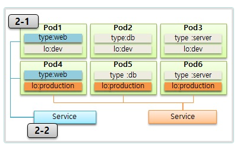
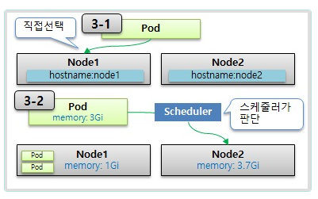

# Pod

> Container, Label, NodeSchedule


## 1. Container 

    

    > 필독! Pod 생성시 확인 사항
Kubernetes Dashboard 상단 콤보박스에서 꼭 Namespace를 [default]로 해서 작업해주세요. 만약 [모든 네임스페이스]로 되어 있다면 Pod 생성시 [Deploying file has failed] 에러가 발생합니다.

  ### 1-1) Pod

```yaml
apiVersion: v1
kind: Pod
metadata:
  name: pod-1
spec:
  containers:
  - name: container1
    image: academyitwill/p8000
    ports:
    - containerPort: 8000
  - name: container2
    image: academyitwill/p8080
    ports:
    - containerPort: 8080
```
- pod id 확인(20.96.36.114)
- master node에접속해서 요청

```bash
[root@k8s-master ~]# curl  20.96.36.114:8000
pod-1[20.96.36.114] containerPort : 8000
[root@k8s-master ~]# curl  20.96.36.114:8080
pod-1[20.96.36.114] containerPort : 8080
[root@k8s-master ~]# 

```
- pod-1의 container1 접속해서 container2에 요청

```bash
  bash-4.4# curl 20.96.36.114:8000
  pod-1[20.96.36.114] containerPort : 8000
  bash-4.4# curl 20.96.36.114:8080
  pod-1[20.96.36.114] containerPort : 8080
  bash-4.4# 
```


```yaml
apiVersion: v1
kind: Pod
metadata:
  name: pod-2
spec:
  containers:
  - name: container1
    image: academyitwill/p8000
    ports:
    - containerPort: 8000
  - name: container2
    image: academyitwill/p8000
    ports:
    - containerPort: 8080
```

- 한 pod내에서 같은포트사용불가능
- pod IP는 재생성시 변경된다.


  ### 1-2) ReplicationController

```yaml
apiVersion: v1
kind: ReplicationController
metadata:
  name: replication-1
spec:
  replicas: 1
  selector:
    app: rc
  template:
    metadata:
      name: pod-1
      labels:
        app: rc
    spec:
      containers:
      - name: container
        image: academyitwill/init
 ```

 - pod IP확인후 pod삭제하면 다시pod생성된후 IP는 변경됨 

 ## 2. Label

 

 ### 2-1) Pod

```bash

apiVersion: v1
kind: Pod
metadata:
  name: pod-1
  labels:
    type: web
    lo: dev
spec:
  containers:
  - name: container
    image: academyitwill/init

---

apiVersion: v1
kind: Pod
metadata:
  name: pod-2
  labels:
    type: db
    lo: dev
spec:
  containers:
  - name: container
    image: academyitwill/init

---    

apiVersion: v1
kind: Pod
metadata:
  name: pod-3
  labels:
    type: server
    lo: dev
spec:
  containers:
  - name: container
    image: academyitwill/init
---    

apiVersion: v1
kind: Pod
metadata:
  name: pod-4
  labels:
    type: web
    lo: production
spec:
  containers:
  - name: container
    image: academyitwill/init

---    

apiVersion: v1
kind: Pod
metadata:
  name: pod-5
  labels:
    type: db
    lo: production
spec:
  containers:
  - name: container
    image: academyitwill/init    

--- 

apiVersion: v1
kind: Pod
metadata:
  name: pod-6
  labels:
    type: server
    lo: production
spec:
  containers:
  - name: container
    image: academyitwill/init   

```

  ### 2-2) Service

- selector에 type:web [labels에 type이 web 태그를 가진 pod 선택(pod-1,pod-2)]

```bash
apiVersion: v1
kind: Service
metadata:
  name: svc-for-web
spec:
  selector:
    type: web
  ports:
  - port: 8080

```

- selector에 lo:production [labels에 lo가 production 태그를 가진 pod 선택(pod-4,pod-5,prod-6)]

```bash
apiVersion: v1
kind: Service
metadata:
  name: svc-for-production
spec:
  selector:
    lo: production
  ports:
  - port: 8080

```


## 3. Node Schedule



  ### 3-1) Pod

  ```yaml
    apiVersion: v1
    kind: Pod
    metadata:
      name: pod-3
    spec:
      nodeSelector:
        kubernetes.io/hostname: k8s-node1
      containers:
      - name: container
        image: academyitwill/init
  ```
    
  ### 3-2) Pod

  ```yaml
  apiVersion: v1
  kind: Pod
  metadata:
    name: pod-4
  spec:
    containers:
    - name: container
      image: academyitwill/init
      resources:
        requests:
          memory: 2Gi
        limits:
          memory: 3Gi
  ```
