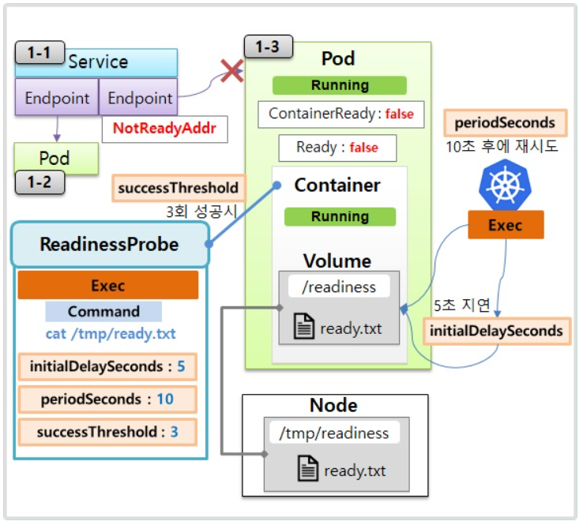
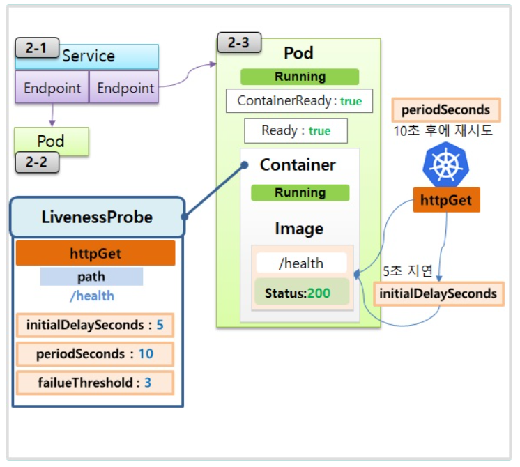

# Pod

> Readinessprobe, Livenessprobe

> Pod의 여러 특성과 기능들을 학습합니다.


## 1. ReadinessProbe 

    

    
  ### 1-1) Service

```yaml
apiVersion: v1
kind: Service
metadata:
  name: svc-readiness
spec:
  selector:
    app: readiness
  ports:
  - port: 8080
    targetPort: 8080
```


  ### 1-2) Pod

```yaml
apiVersion: v1
kind: Pod
metadata:
  name: pod1
  labels:
    app: readiness  
spec:
  containers:
  - name: container
    image: kubetm/app
    ports:
    - containerPort: 8080	
  terminationGracePeriodSeconds: 0
```

```bash
while true; do date && curl 10.97.190.80:8080/hostname; sleep 1; done
```

 ### 1-3) Pod

```yml
apiVersion: v1
kind: Pod
metadata:
  name: pod-readiness-exec1
  labels:
    app: readiness  
spec:
  containers:
  - name: readiness
    image: kubetm/app
    ports:
    - containerPort: 8080	
    readinessProbe:
      exec:
        command: ["cat", "/readiness/ready.txt"]
      initialDelaySeconds: 5
      periodSeconds: 10
      successThreshold: 3
    volumeMounts:
    - name: host-path
      mountPath: /readiness
  volumes:
  - name : host-path
    hostPath:
      path: /tmp/readiness
      type: DirectoryOrCreate
  terminationGracePeriodSeconds: 0
```

```bash
kubectl get events -w | grep pod-readiness-exec1
kubectl describe pod pod-readiness-exec1 | grep -A5 Conditions
kubectl describe endpoints svc-readiness
touch ready.txt
```

## 2. LivenessProbe



  ### 2-1) Service

```yaml
apiVersion: v1
kind: Service
metadata:
  name: svc-liveness
spec:
  selector:
    app: liveness
  ports:
  - port: 8080
    targetPort: 8080
```
    
  ### 2-2) Pod

```yaml
apiVersion: v1
kind: Pod
metadata:
  name: pod2
  labels:
    app: liveness
spec:
  containers:
  - name: container
    image: kubetm/app
    ports:
    - containerPort: 8080
  terminationGracePeriodSeconds: 0
```

  ### 2-2) Pod
 
 ```yml
 apiVersion: v1
kind: Pod
metadata:
  name: pod2
  labels:
    app: liveness
spec:
  containers:
  - name: container
    image: kubetm/app
    ports:
    - containerPort: 8080
  terminationGracePeriodSeconds: 0
```  

   ### 2-3) Pod

```yml
apiVersion: v1
kind: Pod
metadata:
  name: pod-liveness-httpget1
  labels:
    app: liveness
spec:
  containers:
  - name: liveness
    image: kubetm/app
    ports:
    - containerPort: 8080
    livenessProbe:
      httpGet:
        path: /health
        port: 8080
      initialDelaySeconds: 5
      periodSeconds: 10
      failureThreshold: 3
  terminationGracePeriodSeconds: 0
```

```bash
while true; do date && curl 10.103.160.58:8080/health; sleep 1; done
watch "kubectl describe pod pod-liveness-httpget1 | grep -A10 Events"
curl 20.109.131.43:8080/status500
```

  ## Sample Yaml
   ### Pod
```yml   
apiVersion: v1
kind: Pod
metadata:
  name: pod-probe
  labels:
    app: probe
spec:
  containers:
  - name: probe
    image: kubetm/app
    ports:
    - containerPort: 8080	
    readinessProbe:
      exec:                   # command 내용으로 점검
        command: ["cat", "/readiness/ready.txt"]   
      initialDelaySeconds: 10
      periodSeconds: 5
      successThreshold: 3     # 3번 성공시 Service와 연결됨
    livenessProbe:
      httpGet:                # HttpGet 메소드로 점검
        path: /health         # 체크할 경로
        port: 8080            # 체크할 Port
      initialDelaySeconds: 5  # 최초 5초 후에 LivenessProbe 체크를 시작함
      periodSeconds: 10       # 10초마다 LivenessProbe 체크
      failureThreshold: 3      # 3번 실패시 Pod Restart
```

  ## kubectl
   ### Watch

```bash   
# Object들의 모든 Event 정보를 지속적으로 조회해서 | 그중에 pod-readiness-exec1라는 단어와 매칭되는 내용만 출력
kubectl get events -w | grep pod-readiness-exec1
# pod-readiness-exec1이름의 Pod 상세 내용중에 | Events와 매칭되는 단어에서 20번째 줄까지 지속적으로 출력
watch "kubectl describe pod pod-readiness-exec1 | grep -A20 Events"
```


  ## Tips
   ### **HTTP Status**

   - 200 ~ 400까지는 성공 그외의 상태코드는 실패
