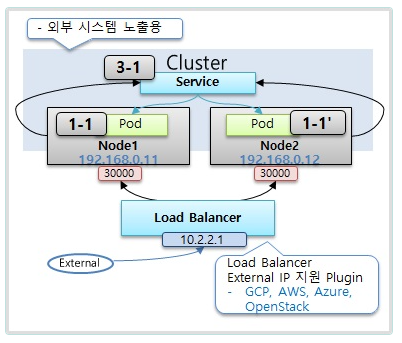

# Service

> ClusterIP, NodePort, LoadBalancer


  ## 1. ClusterIP  

  


  ### 1-1) Pod

```yaml
apiVersion: v1
kind: Pod
metadata:
  name: pod-1
  labels:
     app: pod
spec:
  nodeSelector:
    kubernetes.io/hostname: k8s-node1
  containers:
  - name: container
    image: academyitwill/app
    ports:
    - containerPort: 8080
  ```
    


  ### 1-2) Service

```yml
apiVersion: v1
kind: Service
metadata:
  name: svc-1
spec:
  selector:
    app: pod
  ports:
  - port: 9000
    targetPort: 8080
  type: ClusterIP  
```

```bash
[root@k8s-master ~]# curl 10.98.59.131:9000/hostname
```
- pod 삭제후 다시생성 pod IP는 변경 됐으나 service객체IP는 그대로임

```bash
[root@k8s-master ~]# curl 10.98.59.131:9000/hostname
```


## 2. NodePort


  ### 2-1) Service

```yml
apiVersion: v1
kind: Service
metadata:
  name: svc-2
spec:
  selector:
    app: pod
  ports:
  - port: 9000
    targetPort: 8080
    nodePort: 30001
  type: NodePort
  externalTrafficPolicy: Local
  ```

  ```dos
  C:\Users\itwill>curl 192.168.56.31:30001/hostname
  Hostname : pod-1

  ```

```yml
apiVersion: v1
kind: Pod
metadata:
  name: pod-2
  labels:
     app: pod
spec:
  nodeSelector:
    kubernetes.io/hostname: k8s-node2
  containers:
  - name: container
    image: kubetm/app
    ports:
    - containerPort: 8080
```  

- pod로 트레픽이분산되서 요청됨
- local  node에있는 pod만서비스해줌(externalTrafficPolicy: Local)

> kubernetes dahsboard UI Port가 30000으로 변경되어 해당 실습 port는 30001로 하시면 됩니다.


## 3. Load Balancer



  ### 3-1) Service

```yml
apiVersion: v1
kind: Service
metadata:
  name: svc-3
spec:
  selector:
    app: pod
  ports:
  - port: 9000
    targetPort: 8080
  type: LoadBalancer
```  

```bash
kubectl get service svc-3
```

- 외부 external ip 할당플러그인설치안되있으므로 서비스가 pending상태
- k8s-master --> kubectl get service svc-3


## Sample Yaml

### **Service**

```yml
apiVersion: v1
kind: Service
metadata:
  name: svc-3
spec:
  selector:             # Pod의 Label과 매칭
    app: pod
  ports:
  - port: 9000          # Service 자체 Port
    targetPort: 8080    # Pod의 Container Port
  type: ClusterIP, NodePort, LoadBalancer  # 생략시 ClusterIP
  externalTrafficPolicy: Local, Cluster    # 트래픽 분배 역할

```


## kubectl

### **Get**

  - defalut 이름의 Namespace에서 svc-3 이름의 Service 조회

  ```bash
  kubectl get service svc-3 -n defalut
  ```
### Tips

  - Node Port의 범위 : 30000~32767