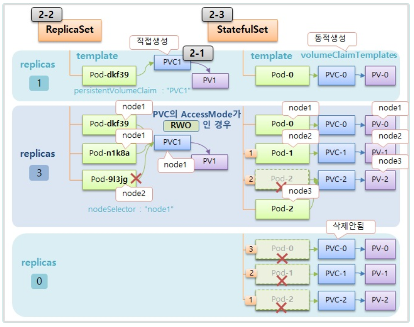

# Statefulset

> Pod, PersistentVolume, Headless Service


  ## 1. StatefulSet Controller
  
  

   ### 1-1) ReplicaSet 

```yaml
apiVersion: apps/v1
kind: ReplicaSet
metadata:
  name: replica-web
spec:
  replicas: 1
  selector:
    matchLabels:
      type: web
  template:
    metadata:
      labels:
        type: web
    spec:
      containers:
      - name: container
        image: academyitwill/guest
      terminationGracePeriodSeconds: 10
```

   ### 1-2) StatefulSet

```yml
apiVersion: apps/v1
kind: StatefulSet
metadata:
  name: stateful-db
spec:
  replicas: 1
  selector:
    matchLabels:
      type: db
  template:
    metadata:
      labels:
        type: db
    spec:
      containers:
      - name: container
        image: itwillacademy/app
      terminationGracePeriodSeconds: 10
```

- **replica-web(ReplicaSet)과 stateful-db(StatefulSet)의 replicas의 수를 3으로 증가**

```bash
[root@k8s-master ~]# kubectl get pods
NAME                READY   STATUS    RESTARTS   AGE
replica-web-clvlk   1/1     Running   0          9m34s
replica-web-dfw77   1/1     Running   0          12m
replica-web-gsw42   1/1     Running   0          9m34s
stateful-db-0       1/1     Running   0          10m
stateful-db-1       1/1     Running   0          9m15s
stateful-db-2       1/1     Running   0          9m13s
[root@k8s-master ~]# 
```
- **replica-web-clvlk(Pod) 삭제하면 삭제와동시에 새로운Pod가생성되고 10초후에 해당파드삭제됨**

- **stateful-db-0(Pod) 삭제하면 완전히삭제된후 같은이름의(stateful-db-0) Pod가생성됨**

- **replica-web(ReplicaSet) replicas를 0으로 줄이게되면 10초후에 동시에 파드들이 삭제됨**

- **stateful-db(StatefulSet) replicas를 0으로 줄이게되면 10초 간격으로 파드들이 삭제됨**

  ## 2. PersistentVolumeClaim 

  


  ### 2-1) PersistentVolumeClaim

```yml
apiVersion: v1
kind: PersistentVolumeClaim
metadata:
  name: replica-pvc1
spec:
  accessModes:
  - ReadWriteOnce
  resources:
    requests:
      storage: 1G
  storageClassName: "fast"
```
   ### 2-2) ReplicaSet

```yml
apiVersion: apps/v1
kind: ReplicaSet
metadata:
  name: replica-pvc
spec:
  replicas: 1
  selector:
    matchLabels:
      type: web2
  template:
    metadata:
      labels:
        type: web2
    spec:
      nodeSelector:
        kubernetes.io/hostname: k8s-node1
      containers:
      - name: container
        image: itwillacademy/init
        volumeMounts:
        - name: longhorn
          mountPath: /applog
      volumes:
      - name: longhorn
        persistentVolumeClaim:
          claimName: replica-pvc1
      terminationGracePeriodSeconds: 10
```

- **파드안에들어가서 mountPath 인 /applog 안에server.log 파일생성**

```bash
[root@replica-pvc-xpzzv /]# cd /applog
[root@replica-pvc-xpzzv applog]# touch server.log
[root@replica-pvc-xpzzv applog]# ls
lost+found  server.log
[root@replica-pvc-xpzzv applog]# 
```
- **replica-pvc(ReplicaSet)의 replicas의 scale을  3으로증가**


- **새로생성된 eplica-pvc-kpxwp(Pod)의 컨테이너로접속해서 mountPath(/applog/server.log)확인**

```bash
[root@replica-pvc-kpxwp /]# ls
anaconda-post.log  applog  bin  boot  dev  etc  home  lib  lib64  media  mnt  opt  proc  root  run  sbin  srv  sys  tmp  usr  var
[root@replica-pvc-kpxwp /]# cd applog
[root@replica-pvc-kpxwp applog]# ls
lost+found  server.log
[root@replica-pvc-kpxwp applog]# 
```

   ### 2-3) StatefulSet 

```yml
apiVersion: apps/v1
kind: StatefulSet
metadata:
  name: stateful-pvc
spec:
  replicas: 1
  selector:
    matchLabels:
      type: db2
  serviceName: "stateful-headless"
  template: 
    metadata:
      labels:
        type: db2
    spec:
      containers:
      - name: container
        image: itwillacademy/app
        volumeMounts:
        - name: volume
          mountPath: /applog
      terminationGracePeriodSeconds: 10
  volumeClaimTemplates:
  - metadata:
      name: volume
    spec:
      accessModes:
      - ReadWriteOnce
      resources:
        requests:
          storage: 1G
      storageClassName: "fast"
```

- **StatefulSet의 volumeClaimTemplates으로 만들어진 volume-stateful-pvc-0(PersistentVolumeClaim)**


- **볼륨이 mount된 stateful-pvc-0(Pod) 의 마운팅된 패쓰로 들어가서 파일생성**

```bash
root@stateful-pvc-0:/# cd applog
root@stateful-pvc-0:/applog# touch server1.log
root@stateful-pvc-0:/applog# ls
lost+found  server1.log
```

- **StatefulSet(stateful-pvc)의 replicas 를 3으로 변경하면 pvc로 순차적으로 생성됩니다.**

 #### PersistentVolumeClaim 의이름은 볼륨이름-파드이름 형식으로 생성됩니다.
  > volume-stateful-pvc-0,volume-stateful-pvc-1,volume-stateful-pvc-2 ...


- **볼륨이 mount된 stateful-pvc-0(Pod) 의 마운팅된 패쓰로 들어가서 파일생성**

   ## 3. Headless Service

  

   ### 3-1) Service (Headless)

```yml
apiVersion: v1
kind: Service
metadata:
  name: stateful-headless
spec:
  selector:
    type: db2
  ports:
    - port: 80
      targetPort: 8080    
  clusterIP: None
```
     
   ### 3-2) Pod 

```yml
apiVersion: v1
kind: Pod
metadata:
  name: request-pod
spec:
  containers:
  - name: container
    image: kubetm/init
```

```bash
nslookup stateful-headless
curl stateful-pvc-0.stateful-headless:8080/hostname
```

  ## 4 Longhorn 삭제 

  자원을 많이 먹으니 실습 후 꼭 삭제해주세요

  ```bash
  kubectl delete -f https://raw.githubusercontent.com/kubetm/kubetm.github.io/master/yamls/longhorn/longhorn-1.5.0.yaml
  ```